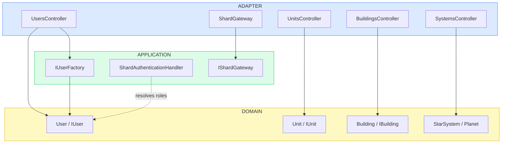

# IonShard


Space strategy game shard API. ASP.NET Core 7 · C# 11 · Clean Architecture · MongoDB · role-based auth · Docker Compose.

---

## Architecture Overview



Each request enters through an ASP.NET controller (ADAPTER), delegates to domain objects and factories (DOMAIN), with cross-cutting services in APPLICATION. MongoDB persistence lives in a `Persistence` layer that implements repository interfaces defined in APPLICATION. The `ShardGateway` relays unit jumps to remote shards via HTTP, keeping inter-shard logic out of domain code.

---

## Clean Architecture

Three concentric layers, dependencies point inward only. DOMAIN imports no ASP.NET, MongoDB, or infrastructure type.

| Layer | Package path | Responsibilities |
|---|---|---|
| ADAPTER | `IonShard/Adapters/` | ASP.NET controllers, MongoDB repository implementations, inter-shard HTTP gateway, DTO mappers |
| APPLICATION | `IonShard/Application/` | Use-case services, factory interfaces, custom Basic auth handler |
| DOMAIN | `IonShard/Domain/` | Entities (User, Unit, Building, StarSystem, Planet), domain rules, guard clauses |

Domain invariants are enforced at the method level, not in DTO annotations:

```csharp
// DOMAIN layer -- zero framework dependency
public class CargoUnit : ICargoUnit
{
    public void Load(IResource resource, int quantity)
    {
        if (/* no starport at current location */)
            throw new InvalidOperationException(
                "Cannot load cargo, its location does not contain a starport.");
    }
}
```

Business rules enforced in domain constructors and methods, not in a `[Range]` attribute on a DTO.

---

## Architecture Decisions

### Clean Architecture (Onion pattern, Robert C. Martin): dependencies inward only

**Context.**
Game logic (unit travel, resource extraction, building construction) needs to be testable without spinning up ASP.NET or MongoDB. Coupling domain to infrastructure would require a running database for every unit test.

**Decision.**
Three-layer structure: DOMAIN at the center, APPLICATION in the middle, ADAPTER at the edge. Inner layers define interfaces; outer layers implement them.

**Consequence.**
Domain and application logic is unit-testable without any infrastructure dependency. Controllers and repositories can be replaced without touching game rules.

---

### Custom Basic Authentication handler instead of JWT

**Context.**
Inter-shard communication uses a pre-shared password scheme defined in `users.json` configuration. Standard JWT Bearer middleware would require a token issuance endpoint that the shard-to-shard protocol does not use.

**Decision.**
Implement `ShardAuthenticationHandler`, a custom `IAuthenticationHandler`, that reads credentials from configuration and resolves `Admin` and `Shard` roles from Basic auth headers.

**Consequence.**
Auth is fully configuration-driven with no token issuance infrastructure. Role resolution is centralized in one handler.

---

### OpenAPI documentation via Swashbuckle and controller annotations

**Context.**
The API serves game clients, other shards, and admin tooling. Maintaining endpoint documentation separately from code leads to drift.

**Decision.**
Use `Swashbuckle.AspNetCore` with `[SwaggerOperation]` annotations on controller actions. A custom `RequestBodiesDocumentFilter` adds non-standard request body schemas that Swashbuckle does not infer automatically.

**Consequence.**
API documentation is always in sync with the code. Swagger UI is available at `/swagger` in development.

---

### Domain guard clauses via exceptions

**Context.**
Operations such as loading cargo, starting construction, or moving units have game-rule preconditions (starport presence, builder location, resource availability). Validating these in controllers would scatter domain logic across the adapter layer.

**Decision.**
Domain methods (`CargoUnit.Load`, `BuilderUnit.StartBuild`, `Unit.StartTravel`) throw `InvalidOperationException` or `ArgumentException` when preconditions fail. Controllers catch at the adapter boundary.

**Consequence.**
Game rules are co-located with the entities they protect. Domain is independently testable. Controllers stay thin.

---

### Wormhole Gateway for inter-shard unit transfers

**Context.**
Units can jump between shards. Each shard exposes the same REST API, so a unit leaving IonShard must be `PUT` onto the target shard with the correct credentials and wormhole destination URI.

**Decision.**
`ShardGateway` implements `IShardGateway` (APPLICATION interface) using `HttpClient`. Destination URIs, systems, and credentials are read from `wormholes.json` config at startup.

**Consequence.**
Inter-shard HTTP logic is isolated in one adapter class. Domain and application layers have no HTTP dependency. Target shards are swappable via configuration.

---

## Getting Started

**Prerequisites:** .NET 7.0 SDK, Docker + Docker Compose

```bash
git clone https://github.com/<your-handle>/ion-shard.git
cd ion-shard
docker-compose up --build
```

To run without Docker:

```bash
dotnet run --project IonShard/IonShard.csproj
```

Swagger UI (development only): `http://localhost:5000/swagger`

---

## Tech Stack

| Concern | Technology |
|---|---|
| Language | C# 11 |
| Framework | ASP.NET Core 7.0 |
| Build | .NET SDK 7 |
| Database | MongoDB |
| DB layer | MongoDB.Driver (no ORM) |
| API docs | Swagger (Swashbuckle.AspNetCore 6.5) |
| Auth | Basic auth (custom ASP.NET Core handler) |
| Shared core | Shard.Shared.Core (map generation, clock abstraction) |

---

## Testing

Unit tests in `IonShard.UnitTests` (xUnit + Moq). Integration tests in `IonShard.IntegrationTests` using the shared `Shard.Shared.Web.IntegrationTests` harness with a `FakeClock` for time-dependent travel and build scenarios.

```bash
dotnet test
```

---

## API Reference

See [API_REFERENCE.md](./API_REFERENCE.md) for full endpoint documentation including request bodies, response schemas, path parameters, and error codes.
